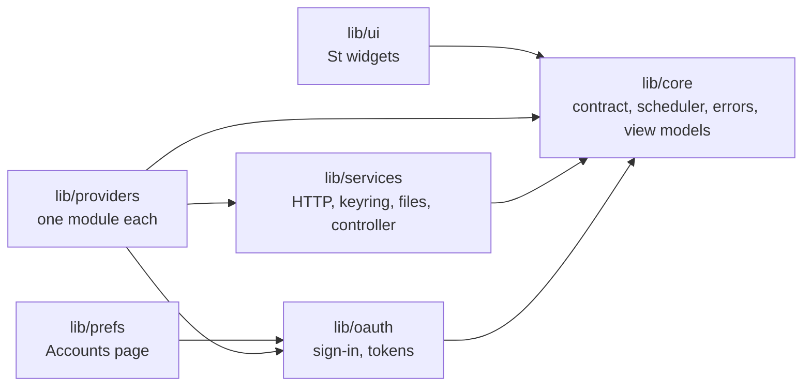

# Development

A guide for working on the code. For what the extension is and how to install
it, read the [README](../README.md); for why it is built this way, the
[ADRs](adr/README.md).

## Setup

You need GNOME Shell 50, `gjs`, `glib-compile-schemas`, the gettext tools
(`msgfmt`, `xgettext`, `msgmerge`), `python3`, and `mutter-devkit` for the nested
shell (`sudo dnf install mutter-devkit`).

```sh
git clone https://github.com/dandgabr/gnome-ai-quota.git
cd gnome-ai-quota
tools/build.sh
```

The extension needs `schemas/gschemas.compiled` and `locale/` to run from a
checkout. Neither is committed. Run `tools/build.sh` after cloning and after
changing `schemas/` or `po/`.

## Layout

```
extension.js        entry point (enable and disable)
prefs.js            preferences window (GTK 4, libadwaita)
lib/core/           pure JavaScript: contract, scheduler, errors, cache format, the parser
                    of each provider's reply, theme compiler and its CSS template,
                    severity, pacing, selection, fitting, formatting, view models
lib/providers/     the registry, one module per provider, the demo providers
lib/oauth/          PKCE, the sign-in's local server and flow, the token manager
lib/services/       GLib, Gio and Soup glue: HTTP, keyring, timers, cache file, theme
                    files, theme manager, quota controller
lib/prefs/          the Accounts page and the theme picker text (GTK 4, libadwaita)
lib/ui/             St widgets: meter, bar item, provider card, indicator, tooltip
themes/builtin/     the 20 built-in themes, one folder each with a theme.json
themes/v1.txt       the style slugs that tools/gen-themes.py generates
schemas/            GSettings schema
icons/              symbolic SVG icons, one per provider id
po/                 gettext template and translations
tests/              unit tests (no GNOME Shell needed)
tools/              build, translation, theme generation and test-shell scripts
```

## Architecture rules



The arrows say who may import whom. `tests/structure.test.js` checks the parts that matter:
the core imports nothing outside the core and no `gi://` module, St and the shell
modules stay in `lib/ui`, `extension.js` and the theme manager, and GTK and Adwaita stay in
`prefs.js` and `lib/prefs`.

- `lib/core` is pure. It imports no `gi://` or `resource://` module, so it runs under
  plain `gjs` and the tests cover it. Everything the UI shows is computed there
  (`viewmodel.js`) and painted by `lib/ui`.
- `lib/services` holds the GLib and Gio code: timers, files, the controller that
  runs the scheduler. All I/O is asynchronous, except the small theme files read when
  the theme changes.
- `lib/ui` only draws. It takes view models and emits callbacks, and keeps no
  business logic.
- `lib/providers` holds one module per provider, behind the contract in
  `lib/core/contract.js`. A broken provider affects only its own card. Providers are
  listed in `lib/providers/registry.js`, which the Accounts page is generated from; adding
  one is described in [ADR 0009](adr/0009-adding-providers.md).
- `prefs.js` runs in a separate process from the shell and uses GTK 4 and
  libadwaita. Never import GTK or Adw in code that the shell loads.

## Tests

```sh
gjs -m tests/run.js
```

The suite covers the core, the theme compiler, the sign-in (PKCE, the local server, the flow and
the token manager, against local servers), the HTTP client, the cache on disk and the checks
that keep secrets out of the repository. Add a test with the code you change.
`tests/harness.js` is a minimal runner: a test that does not finish in 15 seconds fails,
`tmpDir()` gives a folder removed afterwards, and `gjs -m tests/run.js -- <text>` runs only the
tests whose name contains `<text>`.

`tools/check.sh` runs the tests together with everything else that needs no graphical session:
script syntax, ShellCheck, the schemas, the translation template and catalogs (including that
every placeholder survives translation) and whitespace. Run it before a commit.

## Three ways to run it

| Way | Command | Good for |
|---|---|---|
| Unit tests | `gjs -m tests/run.js` | Logic in `lib/core`: severity, pacing, scheduler, themes, formatting. Fast, no shell. |
| Headless shell | `tools/headless-shell.sh` | Scripted checks and screenshots, and finding errors in the shell log. No window. |
| Nested shell | `tools/nested-shell.sh [prefs]` | Looking at the bar and the popup, trying themes, using the preferences window. |

All three leave your session, settings and extensions alone.

### Headless shell

`tools/headless-shell.sh` starts `gnome-shell --headless` on its own D-Bus session,
with an in-memory GSettings backend and a temporary `XDG_DATA_HOME` that links
this checkout as the only user extension. It enables the extension, prints its state
and the shell errors that mention it.

```sh
# Boot, enable the extension, print its state and any shell errors.
tools/headless-shell.sh

# Also evaluate JavaScript inside the shell (org.gnome.Shell.Eval, enabled by
# --unsafe-mode). Scripts run in order, 1.5 seconds apart; sleep:20 waits that
# many seconds, useful for the polling scenarios.
tools/headless-shell.sh open-popup.js sleep:20 screenshot.js
```

Useful snippets for the scripts: `Main.panel.statusArea[uuid].menu.open(false)` opens
the popup; a `Shell.Screenshot` call writes a PNG of the virtual monitor; walking
`get_children()` with `get_allocation_box()` and `get_preferred_width(-1)` prints
sizes. Avoid backslashes in the scripts, because `gdbus` parses the argument as a
GVariant string. Set `SKIP_ENABLE=1` to boot without enabling the extension and
compare the shell log against a clean baseline.

### Nested shell

`tools/nested-shell.sh` opens a throwaway GNOME Shell in a window, with the extension
enabled. `tools/nested-shell.sh prefs` also opens the preferences window. Closing
the window ends the session. It stores settings in a key file instead of memory,
because the preferences window is a second process and must see the same values as
the shell.

### Demo scenarios

With the `data-source` setting on `demo` (Preferences, General, Advanced), the `demo-scenario`
setting chooses what the made-up providers do: `steady`, `flaky` or `drift` (see the README). In a session where the
extension is installed, change it with:

```sh
gsettings --schemadir schemas set org.gnome.shell.extensions.gnome-ai-quota demo-scenario flaky
```

The throwaway shells keep their settings out of reach of a `gsettings` call from
outside, so set the key from a headless script with `Gio.Settings` instead.

## Package

`tools/pack.sh` builds `dist/<uuid>.shell-extension.zip` with everything the extension needs
(code, icons, themes, schema and translations) and nothing else (no tests, tools or docs).
Install it with `gnome-extensions install --force`, then log out and in. `gnome-extensions
install` compiles the schema; unpacking the zip by hand does not.

## Signing in to OAuth providers

The sign-in needs the provider's client id in `~/.config/gnome-ai-quota/providers.local.json`
(see `providers.example.json`). Run `python3 -I tools/import-client-ids.py` once: it looks for
the id in the AI tool installed on your computer, then in that tool's open-source code, and
writes it to the file with mode 0600 without printing it. The nested shell copies that file in,
so Connect works there too, and keeps the sign-in in its own throwaway keyring.

Enable the pre-commit hook once per clone with `git config core.hooksPath .githooks`. It always
runs `tools/check-secrets.py` (credential formats, hashes of known client ids, every value of your
local file) and also gitleaks when it is installed. It refuses the commit when it finds something.

## Themes

A theme is a `theme.json` (see the README for the format and ADR 0006 for the
tokens). All CSS lives in `lib/core/theme.template.css`. Colors, radii, borders,
shadows and fonts are tokens that `lib/core/theme.js` substitutes at compile time,
because St has no `var()`.

### Add a theme

1. Create `themes/builtin/<id>/theme.json`. The id uses lowercase letters, digits
   and dashes, and must match the folder name.
2. Give it both schemes with the eight required colors (`bg`, `surface`, `fg`,
   `muted`, `border`, `accent`, `warn`, `danger`).
3. Add its group and description to `lib/ui/themeCatalog.js` so the picker can
   translate them, then run `tools/i18n.sh all`.
4. Run the tests. They validate and compile every built-in theme, and one of them
   asserts the count of twenty, so update it when the set changes.

To try a theme without opening Preferences:

```sh
gsettings --schemadir schemas set org.gnome.shell.extensions.gnome-ai-quota theme linear-saas
gsettings --schemadir schemas set org.gnome.shell.extensions.gnome-ai-quota color-scheme dark
```

For a theme of your own, put it in `~/.local/share/gnome-ai-quota/themes/<id>/`
instead; the picker rescans that folder whenever it opens.

### Generated themes

19 of the 20 built-in themes come from a gallery of visual styles
(`dandgabr/estilos-visuais`). `tools/gen-themes.py` reads the gallery's design
tokens, derives the missing light or dark scheme in OKLCH, corrects contrast to
WCAG targets (text 7:1, secondary text and status colors 4.5:1, accent 3:1) and
writes one `theme.json` per style. It exits with status 1 if a scheme still fails.

```sh
python3 -I tools/gen-themes.py --styles <path to an estilos-visuais clone> \
    --out themes/builtin --only themes/v1.txt
```

`themes/v1.txt` lists the slugs. `sistema-gnome` is written by hand and the tool
does not touch it. Review the diff after regenerating, since the output replaces
the files.

## Translations

Source strings are English. Every user-visible string goes through `gettext`,
`ngettext` or `pgettext` (see [ADR 0007](adr/0007-internationalization.md)), with
named placeholders instead of concatenation.

```sh
tools/i18n.sh extract   # regenerate po/gnome-ai-quota.pot from the code
tools/i18n.sh update    # merge the template into every po/*.po
tools/i18n.sh compile   # build locale/<lang>/LC_MESSAGES/gnome-ai-quota.mo
tools/i18n.sh all       # all three
```

After `update`, new strings in `po/pt_BR.po` are empty and `msgmerge` may add
fuzzy guesses. `tools/po-fill.py` rebuilds `po/pt_BR.po` from the template: it keeps
the existing translations that are not fuzzy, adds the ones from a JSON file you
give it, and prints the msgids still untranslated.

```sh
python3 -I tools/po-fill.py new-translations.json
```

The JSON maps a msgid to its translation, or to `["singular", "plural"]` for plural
entries. To add a language, add `po/<lang>.po` (`msgmerge` can create it from the
template) and run `tools/i18n.sh compile`. The compiled `locale/` directory is not
committed.

## Conventions

- English everywhere in the repository: code, identifiers, comments, documentation,
  commit messages, issue and pull request text, and gettext `msgid` strings.
  Brazilian Portuguese lives only in `po/pt_BR.po`.
- CSS classes start with `gaq-`.
- Commits follow [Conventional Commits](https://www.conventionalcommits.org/)
  (`feat:`, `fix:`, `docs:`, `refactor:`, `test:`, `chore:`).
- Clean up in `disable()` and avoid synchronous I/O in the shell process.
- Never commit credentials. See the security note in the README.

## Pitfalls

Things that cost time and are not obvious from the St or GNOME Shell sources.

**Stylesheet**

- The compiler substitutes every double-brace token in the template, comments
  included. Describe tokens in comments without the braces.
- St has no `var()` and no percentage widths. Tokens are substituted at compile
  time; the meter sizes its fill and pacing tick from its allocation
  (`lib/ui/meter.js`).
- A focus ring needs a border. An inset `box-shadow` does not draw on `St.Button`; a
  transparent border that turns blue on `:focus` does.
- A non-reactive popup item greys all its text. The popup sits in a
  `PopupBaseMenuItem` with `reactive: false`, so St applies `:insensitive` and the
  shell theme colors everything `#9b9b9d`. Set `color` on the popup root
  (`.gaq-popup`). When a screenshot looks dim, measure pixels before blaming a stale
  state.

**Layout**

- `BinLayout` centers children that do not expand. An `x_align` or `y_align` of start
  or end is ignored unless the child or one of its descendants has the matching
  `x_expand` or `y_expand`. Set the flag, or place children by hand as
  `lib/ui/meter.js` does.
- Negative margins break layout. A margin that makes the preferred width negative
  wraps to 2^32 in St, which gives huge natural widths, allocations such as
  `-12 x 32` and Cogl viewport criticals. Group widgets in a tighter box.
- `St.ScrollView` only scrolls when it has a `max-height`. The popup computes it
  from the monitor height each time the menu opens. `overlay_scrollbars: false`
  keeps the scrollbar in its own column.
- A layout chosen as "the richest that fits" flips whenever a neighbour's width
  wobbles around the limit. Keep the current layout while it fits
  (`chooseStickyLayout` in `lib/core/fit.js`).
- A popup follows its source actor: `BoxPointer._reposition` re-reads the source
  position on every allocation, so a neighbouring extension that changes width each
  second moves the popup. Pin it with `boxPointer.setPosition(anchor)` to an
  invisible actor while it is open (`_pinPopup` in `lib/ui/indicator.js`).

**Lifecycle**

- Use `connectObject` for signals on objects you do not own. A manual `disconnect`
  in `destroy()` fails with criticals when the emitter (a panel box at shell
  teardown) is already disposed. Read JS fields (`this._cleaned`) before GObject
  properties (`this.mapped`) in callbacks that can run during destruction.
- Remove a widget from its parent before `add_child` to another container, or
  Clutter warns about an existing parent.
- Do not call `get_preferred_width()` on a widget outside the stage; it logs St
  criticals during shell teardown.
- `destroy_all_children()` also destroys siblings you still reference (the `+N`
  badge). Give rebuilt items their own box.
- The popup must not close on inner clicks. Its content lives in one
  `PopupBaseMenuItem` created with `reactive: false`, `can_focus: false` and
  `activate: false`.
- `St.BoxLayout` emits `child-added` and `child-removed`, not `actor-added`. A wrong
  signal name makes the extension fail to load.

**Tooling**

- The `memory` GSettings backend is per process. Settings written in the headless
  shell are invisible to any other process, including the preferences window, which
  is why the nested shell uses the key file backend.
- zsh does not split unquoted variables. When you build a list of arguments for
  `tools/headless-shell.sh`, use an array and `"${args[@]}"`.
