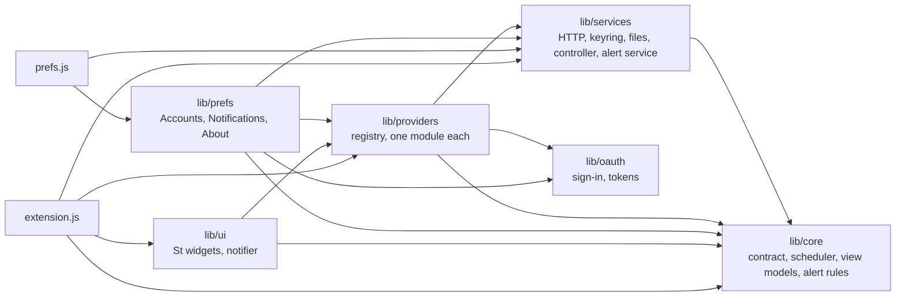

# Development

A guide for working on the code. For what the extension is and how to install
it, read the [README](../README.md); for why it is built this way, the
[ADRs](adr/README.md).

**Contents:** [Setup](#setup) · [Layout](#layout) · [Connector identities](#connector-identities) · [Architecture rules](#architecture-rules) · [Tests](#tests) ·
[Running and checking](#running-and-checking-the-extension) · [Static analysis](#static-analysis) ·
[Package](#package) · [Signing in to OAuth providers](#signing-in-to-oauth-providers) ·
[Themes](#themes) · [Translations](#translations) · [Tools](#tools) · [Contributing](#contributing) ·
[Conventions](#conventions). Pitfalls are in [pitfalls.md](pitfalls.md).

## Setup

You need GNOME Shell 50, `gjs`, `glib-compile-schemas`, the gettext tools
(`msgfmt`, `xgettext`, `msgmerge`), `python3`, and `mutter-devkit` for the nested
shell (`sudo dnf install mutter-devkit`).

```sh
git clone https://github.com/dandgabr/gnome-ai-quota.git
cd gnome-ai-quota
tools/build.sh
```

The extension needs `schemas/gschemas.compiled` and `locale/` to run from a
checkout. Neither is committed. Run `tools/build.sh` after cloning and after
changing `schemas/` or `po/`.

ESLint is optional local developer tooling and required in the lint CI job. It does not run
inside the extension or add a product build step. Use Node.js 24 LTS (CI pins 24.21.0);
Node.js 22.13 or newer on the 22 LTS branch is also supported. Install the exact locked
development dependencies, then lint without starting GNOME Shell:

```sh
npm ci --ignore-scripts
npm run lint
```

The pinned ESLint 10.12.0 supports Node `^20.19.0`, `^22.13.0` or `>=24` according to its
[official prerequisites](https://eslint.org/docs/latest/use/getting-started#prerequisites).
This project selects the maintained 22 and 24 LTS branches; the
[Node release schedule](https://nodejs.org/en/about/previous-releases) identifies their support status.

## Layout

```text
extension.js        entry point (enable and disable)
prefs.js            preferences window (GTK 4, libadwaita)
lib/core/           pure JavaScript: contract, scheduler, errors, cache format, the parser
                    of each provider's reply, theme compiler and its CSS template,
                    severity, pacing, selection, fitting, formatting, view models, the alert
                    rules (alerts.js), their texts (alertText.js), safe text and the
                    Restore defaults classification (defaults.js)
lib/providers/     the registry, one module per provider, the demo providers
lib/oauth/          PKCE, the sign-in's local server and flow, the token manager
lib/services/       GLib, Gio and Soup glue: HTTP, keyring, timers, cache and alert files,
                    theme files, theme manager, quota controller, alert service and the
                    suspend watcher (the only code that talks to the system bus)
lib/prefs/          account controllers and views, the setup assistant, Notifications, About and Restore defaults
                    (GTK 4, libadwaita)
lib/ui/             St widgets (St is the shell's widget toolkit): meter, bar item, provider card, indicator, tooltip, the
                    notifier (the only code that makes notifications), legend and the
                    not-tracked list
themes/builtin/     the 22 built-in themes, one folder each with a theme.json
themes/v1.txt       the style slugs that tools/gen-themes.py generates
schemas/            GSettings schema
icons/              symbolic SVG icons, one per provider id, and the application icon
.github/            CI workflows (gitleaks, static analysis), Dependabot, pinned scanners
po/                 gettext template and translations
tests/              unit tests (no GNOME Shell needed)
tools/              build, translation, theme generation and test-shell scripts
```

## Connector identities

`lib/core/connectors.js` validates a versioned, nonsecret collection of at most
32 connectors and 16 KiB. A connector records `{id, providerId, label, username}`.
Provider IDs select the endpoint, public OAuth configuration, and trusted provider
name; connector IDs key polling, cards, caches, status, tracking, credential
revision targets, and preference routing. Default legacy IDs remain provider IDs;
added IDs are `providerId--UUID`. Renaming never changes identity.

Legacy credentials retain their exact `{provider, kind}` address. Added connectors
use a separate libsecret schema with `{provider, connector, kind}`. Credential
mutation leases remain provider-wide, while addressing and conditional token
replacement operate on the exact connector. Per-connector removal prunes only its
snapshot and alert state. Disconnect-all searches both extension-owned namespaces
so missing registry metadata cannot hide a credential.

Accounts uses a list and editor, sharing connector-keyed controllers with setup.
Explicit registry recovery reads credential identities rather than secret values
and rebuilds metadata after confirmation. Demo uses separate connector metadata
and simulated controllers; its connect/remove actions cannot start a browser,
keyring operation, or provider request. Keep this separation in probes.

Restore defaults resets `untracked-providers` and `first-use-done` alongside
appearance and notification settings. It preserves live/demo connector lists,
credentials, terms, coordination state, public client configuration, and the data
source. See the [connector design](temp/specs/2026-10-08-connectors-design.md)
for the accepted identity and deletion boundaries.

## Architecture rules



The arrows are the imports the code has today, and say who may import whom. `tests/structure.test.js` checks the parts that matter:
the core imports nothing outside the core and no `gi://` module, St and the shell
modules stay in `lib/ui`, `extension.js` and the theme manager, and GTK and Adwaita stay in
`prefs.js` and `lib/prefs`.

- `lib/core` is pure. It imports no `gi://` or `resource://` module, so it runs under
  plain `gjs` and the tests cover it. Everything the UI shows is computed there
  (`viewmodel.js`) and painted by `lib/ui`.
- `lib/services` holds the GLib and Gio code: timers, files, the controller that
  runs the scheduler. Shell and preferences configuration reads are asynchronous
  and bounded; small theme files are read synchronously when the theme changes.
- `lib/ui` only draws. It takes view models and emits callbacks, and keeps no
  business logic.
- `lib/providers` holds one module per provider, behind the contract in
  `lib/core/contract.js`. A broken provider affects only its own card. Providers are
  listed in `lib/providers/registry.js`, which the Accounts page is generated from; adding
  one is described in [ADR 0009](adr/0009-adding-providers.md).
- `prefs.js` runs in a separate process from the shell and uses GTK 4 and
  libadwaita. Never import GTK or Adw in code that the shell loads.

## Tests

```sh
gjs -m tests/run.js
```

The suite covers the core, the theme compiler, the sign-in (PKCE, the local server, the flow and
the token manager, against local servers), the HTTP client, the cache on disk and the checks
that keep secrets out of the repository. Add a test with the code you change.
`tests/harness.js` is a minimal runner: a test that does not finish in 15 seconds fails,
`tmpDir()` gives a folder removed afterwards, and `gjs -m tests/run.js -- <text>` runs only the
tests whose name contains `<text>`.

`tools/check.sh` runs these steps, in this order, and fails if any of them fails:

1. The build: the compiled schema and the catalogs, which some tests read.
2. The unit tests.
3. Cross-process disconnect and private synthetic keyring tests.
4. The syntax of the shell scripts, and of every JavaScript module.
5. ESLint, when the checkout has its local npm dependencies. It detects undefined names and other
   correctness errors using `eslint.config.js`. Without dependencies, this local step reports a skip;
   the separate CI lint job always runs `npm ci --ignore-scripts` and `npm run lint`.
6. **The extension enabled in a headless GNOME Shell.** It reads the extension's state and fails on an
   error. It is skipped when `gnome-shell` is not installed.
7. ShellCheck.
8. The schemas.
9. The translation template and the catalogs, including that every placeholder survives translation.
10. Whitespace.

The local gate also runs `tests/disconnectDisk.sh` and `tests/disconnectSecrets.sh`.
They exercise durable cross-process fencing and exact-scope deletion in a private
state directory, D-Bus session and synthetic keyring. Shell syntax and ShellCheck
include these test scripts. Missing prerequisites fail these gates.

Run it before a commit. For preferences or layout changes, also run:

```sh
tools/prefs-smoke.sh  # 360px setup traversal, RTL, text inflation, larger fonts and closing paths
tools/layout-check.sh # popup allocations and mirrored meters in an isolated demo shell
tools/effects-check.sh lifecycle # 100 actual effect cycles, geometry and teardown
tools/effects-check.sh matrix # 264 current policy/resource combinations; no timing claims
tools/effects-check.sh frames # four 60-second serialized CPU/GPU-finish paint samples
```

The preferences probe injects fake account controllers for traversal, counts their subscriptions
and window handlers after every run, and uses an empty private keyring for full-window startup.
Stateful GTK checks also cover delayed saves and validation, disposed callbacks, keyring recovery,
account/dialog states and focus. The St probe measures enlarged fonts, horizontal label/action
containment, keyboard focus, RTL meter geometry and tooltip cleanup on an 800px virtual monitor.
It never reads a real keyring or opens a browser. The layout probe uses
`lib/core/pseudoLocale.js` only in its temporary shell. Both commands fail on assertion errors.

The unit tests cannot import the interface modules (`lib/ui`, `extension.js`), because they need the
shell. A mistake there (a name declared twice, one that is not defined) only shows when the extension is
enabled, which is what the shell step of `check.sh` is for. Keep the logic in `lib/core`, where it can be
tested, and the interface thin.

## Running and checking the extension

Three tools, each good for something different:

| Way | Command | Good for |
|---|---|---|
| Unit tests | `gjs -m tests/run.js` | Logic in `lib/core`: severity, pacing, scheduler, themes, formatting. Fast, no shell. |
| Headless shell | `tools/headless-shell.sh` | Scripted checks and screenshots, and finding errors in the shell log. No window. |
| Nested shell | `tools/nested-shell.sh [prefs]` | Looking at the bar and the popup, trying themes, using the preferences window. |

All three leave your session, settings and extensions alone.

### Headless shell

`tools/headless-shell.sh` starts `gnome-shell --headless` on its own D-Bus session,
with an in-memory GSettings backend and a temporary `XDG_DATA_HOME` that links
this checkout as the only user extension. It enables the extension, prints its state
and the shell errors that mention it.

All graphical helpers isolate data, configuration, cache, state and runtime;
`XDG_STATE_HOME` must never fall back to the user's disconnect metadata. They also
use a distinct Wayland socket and `GIO_USE_VFS=local`. Set
`GAQ_TEST_MONITORS=1280x800,1600x900` for two virtual monitors. Monitor probes apply
only temporary configurations on that private display.

Run frame profiling without other graphical/scanning jobs. It forces identical
redraw cadence and uses Shell's `glFinish` timestamp, which changes normal
scheduling; this is CPU submission plus GPU-finish wall time, not a pure GPU
timer or presentation latency. The verifier rejects invisible viewports,
insufficient samples and exceeded budgets. Accessibility tools expose partial
metadata/virtual-key evidence and retain explicit limits; they do not certify Orca.

```sh
# Boot, enable the extension, print its state and any shell errors.
tools/headless-shell.sh

# Also evaluate JavaScript inside the shell (org.gnome.Shell.Eval, enabled by
# --unsafe-mode). Scripts run in order, 1.5 seconds apart; sleep:20 waits that
# many seconds, useful for the polling scenarios.
tools/headless-shell.sh open-popup.js sleep:20 screenshot.js
```

For an asynchronous private probe, `wait-for:EXPRESSION` polls its completion
flag up to 60 times, with a one-second D-Bus call deadline and a half-second
pause between attempts. Failure stops the owned shell and fails the check.
The resource matrix and multi-theme focus probe use this bounded completion wait
after their initial delays. Strict result verifiers still check the resource
combinations, keyboard-focus criteria and cleanup.

Useful snippets for the scripts: `Main.panel.statusArea[uuid].menu.open(false)` opens
the popup; a `Shell.Screenshot` call writes a PNG of the virtual monitor; walking
`get_children()` with `get_allocation_box()` and `get_preferred_width(-1)` prints
sizes. Avoid backslashes in the scripts, because `gdbus` parses the argument as a
GVariant string. Set `SKIP_ENABLE=1` to boot without enabling the extension and
compare the shell log against a clean baseline.

### Nested shell

`tools/nested-shell.sh` opens a throwaway GNOME Shell in a window, with the extension
enabled. `tools/nested-shell.sh prefs` also opens the preferences window. Closing
the window ends the session. It stores settings in a key file instead of memory,
because the preferences window is a second process and must see the same values as
the shell.

The nested shell has its own, empty keyring, so no account is connected and the live data source
has nothing to show. To see the bar, the popup or the notifications working, start it with made-up
data:

```sh
DATA_SOURCE=demo DEMO_SCENARIO=drift tools/nested-shell.sh
```

`drift` climbs toward the limits every ten seconds, so the first notifications arrive within a
minute (a notification banner appears at the top of the nested window, and stays in its
notification list). `steady` and `flaky` are the other scenarios.

### Demo scenarios

With the `data-source` setting on `demo` (Preferences, General, Advanced), the `demo-scenario`
setting chooses what the made-up providers do: `steady` (everything fine), `flaky` (errors, a rate limit and
a signed-out provider, every 15 seconds) or `drift` (usage climbs toward the limits every 10 seconds). In a
session where the extension is installed, change it with:

```sh
gsettings --schemadir schemas set org.gnome.shell.extensions.gnome-ai-quota demo-scenario flaky
```

The headless shell keeps its settings in memory, out of reach of a `gsettings` call from
outside, so set the key from a script with `Gio.Settings` instead; the nested shell takes
`DEMO_SCENARIO` (see above).

### Checking a change in a shell

For the interface, run it and look. Methods:

- The bar, the popup and the notifications: `DATA_SOURCE=demo DEMO_SCENARIO=drift
  tools/nested-shell.sh` (see [Nested shell](#nested-shell)). Close the window to end it.
- Scripted checks and screenshots: [`tools/headless-shell.sh`](#headless-shell) with a script. Notes:
  - The `Eval` scope has `Main`, `Gio`, `GLib` and `Shell`, but not `Clutter`.
    Inside an async probe, use `const {default: Clutter} = await import('gi://Clutter')`.
  - A fresh shell shows the Fedora welcome dialog and the overview. Close the dialogs in
    `Main.layoutManager.modalDialogGroup` and call `Main.overview.hide()` first.
  - A virtual pointer that starts at the top-left corner triggers the hot corner. Move it to the middle of
    the screen first.
- One preferences page alone: write a small `gjs -m` program. It builds the page with the settings
  schema and `Gio.memory_settings_backend_new()`, and presents it in an `Adw.PreferencesWindow` inside
  the headless shell. This shows the page without the rest of the window and makes each state easy to
  capture.
- The shell switches an extension off while the screen is locked (it declares no `unlock-dialog`
  session mode), so `Main.screenShield.lock(false)` in a test makes `disable()` run.
- When a change adds a setting, run `tools/build.sh` (or `tools/check.sh`) first: some tests read the
  compiled schema, and an old one does not know the new key.

### Native effect checks

The effect harness needs the same installed GNOME Shell/GJS environment as the
headless shell. Its visual analyzer additionally needs Python Pillow (Fedora:
`python3-pillow`); this is development tooling, not a packaged runtime dependency.

```sh
tools/effects-check.sh quick       # policy, native resources, numbers and lifecycle
tools/effects-check.sh visual      # synthetic backdrop and semantic pixel comparisons
GAQ_EFFECTS_SCHEME=dark tools/effects-check.sh visual
tools/effects-check.sh inventory   # actual 22-theme light/dark native captures
tools/effects-check.sh benchmark   # three separate 60-second measurements
```

These commands start private demo sessions and create their evidence under
`.superpowers/sdd/2026-10-07-post-mvp-execution/`. Captures contain demo data and
synthetic content. Run benchmark without another rendering test at the same time.
The wrapper bounds execution and checks native errors; its temporary session is
removed on exit. Retained screenshots and metrics are ignored by git.

Both Shell helpers use private runtime directories. The interactive nested helper
preserves the parent Wayland/PipeWire preview endpoints before isolating its own
sockets and crash marker. `LOCAL_CONFIG_FILE=/path/to/dummy.json` lets a scripted
nested check use dummy public-client configuration; absent that override, its
existing read-only copy of app configuration remains the manual sign-in workflow.

Pixel comparisons verify local blur, changed backing content and decoration.
Resource policy combinations and screenshot coverage are separate evidence.
Callback elapsed work time, callback cadence and synchronous menu-open work do not measure GPU
frame duration or first-painted latency. Hardware performance, fractional scaling,
multiple monitors, physical keyboard and Orca gates remain explicit in the
[validation record](temp/reviews/2026-10-07-post-mvp-validation.md).

## Static analysis

The checked-in GitHub Actions workflows run on pushes to `main` and pull
requests. Gitleaks and SAST also run weekly; lint has a manual trigger. CodeQL
runs separately through GitHub default setup:

| Workflow | Tool | Looks at |
|---|---|---|
| gitleaks | gitleaks, with `.gitleaks.toml` | secrets in the whole history |
| CodeQL (GitHub's default setup) | CodeQL, extended query suite | the JavaScript, the Python tools and the workflows; results under Security, Code scanning |
| sast (static application security testing) | bandit | the Python tools |
| sast | Semgrep (`p/javascript`, `p/security-audit`, `p/secrets`) | the JavaScript and secrets |
| sast | ShellCheck | the shell scripts and the hook |
| sast | zizmor | the workflows themselves |
| lint | ESLint | GJS modules, tests and Shell Eval probes; no running desktop needed |

`eslint.config.js` uses ESLint's recommended correctness rules with `no-undef` enabled for
`typeof` expressions too. Globals follow the file context: Shell `global` belongs to shell UI
and the theme manager; `Main`, GI shortcuts and `imports` belong to the `tools/*-probe.js` and
`tools/*-verify.js` Eval scripts; `print`, `printerr` and `ARGV` belong to their GJS test runners.
Text codecs and logging are declared only in the module groups that use them. Browser and Node
globals are not granted to runtime modules. GI callback arguments prefixed with `_` may be unused.
Unused caught errors are allowed for deliberate best-effort operations; test fixtures may retain
unused callback parameters. Only the theme validator and alert-text tests allow control-byte regexes,
because those expressions explicitly reject or strip controls.
When adding a script that runs in a different context, declare its actual globals explicitly rather
than enabling a browser or Node environment. Dependencies and Node are development-only;
`tools/pack.sh` does not include the npm manifest, lockfile or `node_modules` in the extension ZIP.

CodeQL is not a workflow file here: the repository uses GitHub's own *default setup* (Settings, Code
security, Code scanning), set to the extended suite for `javascript-typescript`, `python`, and `actions`, with weekly analysis.
GitHub does not accept results from a CodeQL workflow of our own while the default setup is on, so
the repository uses only the default setup. In every tool except CodeQL, a finding fails the job.
Every action is pinned to a commit, workflows get the least permissions they need, and Dependabot (with a one-week cooldown) proposes new versions of the
actions and of the pinned scanners in `.github/requirements-sast.txt`.

`tools/sast.sh` runs the same commands locally (every tool but CodeQL) and skips a tool that is not installed
(`pipx install bandit semgrep zizmor`). When a scanner flags code that is safe, prefer
changing the code so the reason is visible (the HTTP helper in `tools/import-client-ids.py`
uses an opener that only speaks https, rather than an annotation); where an annotation is
right, put the reason in a comment above it.

## Package

`tools/pack.sh` builds `dist/<uuid>.shell-extension.zip` with everything the extension needs
(code, icons, themes, schema, and translations), the client-id helper, the main
AGPL-3.0 `LICENSE`, and the bundled OFL-1.1 font licenses. It excludes tests,
development tools, and documentation.
Install it with `gnome-extensions install --force`, then log out and in. `gnome-extensions
install` compiles the schema; unpacking the zip by hand does not.

The archive follows the [standard GNOME extension layout](https://gjs.guide/extensions/overview/anatomy.html#extension-zip):
`metadata.json` and `extension.js` sit at the ZIP root, alongside runtime folders.
The current metadata declares `version-name: "0.1"` and Shell `50`. Keep the
website-managed numeric `version` field unset for local distribution, as
[GNOME documents](https://gjs.guide/extensions/overview/anatomy.html#version).
A local package build does not publish a GitHub release.

## Signing in to OAuth providers

The sign-in needs the provider's client id in `~/.config/gnome-ai-quota/providers.local.json`
(see `providers.example.json`). Run `python3 -I tools/import-client-ids.py` once: it looks for
the id in the AI tool installed on your computer, then in that tool's open-source code, and
writes it to the file with mode 0600 without printing it. Shell and preferences
read it asynchronously with a 16 KiB streaming limit and a maximum 5-second
cancellation timer for metadata, open, and read operations. Asynchronous stream
closure follows cancellation; the complete promise has no hard 5-second deadline.
Shell callers share one read and cache the result for one minute.
The nested shell copies that file in,
so Connect works there too, and keeps the sign-in in its own throwaway keyring.

## Themes

A theme is a `theme.json` (see [themes.md](themes.md) for the format and
[ADR 0006](adr/0006-theming.md) for the design). All CSS lives in `lib/core/theme.template.css`. Colors, radii, borders,
shadows and fonts are tokens that `lib/core/theme.js` substitutes at compile time,
because St has no `var()`.

### Add a theme

1. Create `themes/builtin/<id>/theme.json`. The id uses lowercase letters, digits
   and dashes, and must match the folder name.
2. Give it both schemes with the eight required colors (`bg`, `surface`, `fg`,
   `muted`, `border`, `accent`, `warn`, `danger`).
3. Add its group and description to `lib/prefs/themeCatalog.js` so the picker can
   translate them, then run `tools/i18n.sh all`.
4. Run the tests. They validate and compile every built-in theme, and one of them
   asserts the exact expected slug set, so update that set when adding a theme.

To try a theme without opening Preferences:

```sh
gsettings --schemadir schemas set org.gnome.shell.extensions.gnome-ai-quota theme linear-saas
gsettings --schemadir schemas set org.gnome.shell.extensions.gnome-ai-quota color-scheme dark
```

For a theme of your own, put it in `~/.local/share/gnome-ai-quota/themes/<id>/`
instead; the picker rescans that folder whenever it opens.

### Generated themes

21 of the 22 built-in themes come from a gallery of visual styles
(`dandgabr/estilos-visuais`). `tools/gen-themes.py` reads the gallery's design
tokens, derives the missing light or dark scheme in OKLCH, corrects contrast to
WCAG targets (text 7:1, secondary text and status colors 4.5:1, accent 3:1) and
writes one `theme.json` per style. Reviewed effect presets come from
`tools/theme-effect-profiles.json`, independently of the gallery's executable effect
files. The generator validates that canonical source and copies each selected profile
after compiling the tokens. It rejects an invalid profile before writing output, and
exits with status 1 if a scheme still fails contrast.

```sh
python3 -I tools/gen-themes.py --styles <path to an estilos-visuais clone> \
    --out themes/builtin --only themes/v1.txt
```

`themes/v1.txt` lists the slugs. `sistema-gnome` is written by hand and the tool
does not touch it; keep its manually authored effect profile in agreement with the
canonical source. Do not edit generated JSON by hand: change the reviewed profile
source or the generator, regenerate, then review the diff. `--effect-profiles <file>`
selects an explicit canonical source for developer checks. The generator and its
profile source are development tools; shipped theme files already contain their
validated effect data.

Review changed character/background color pairs in both schemes, including
focused, hovered, and checked states. The current Cyberpunk light palette and
material corrections are tracked in the
[material diagnosis](temp/reviews/2026-10-08-theme-material-diagnosis.md) and
[manual regression record](temp/reviews/2026-10-08-manual-regressions.md).
Those records distinguish source changes from completed native acceptance.

## Translations

Source strings are English. Every user-visible string goes through `gettext`,
`ngettext` or `pgettext` (see [ADR 0007](adr/0007-internationalization.md)), with
named placeholders instead of concatenation.

```sh
tools/i18n.sh extract   # regenerate po/gnome-ai-quota.pot from the code
tools/i18n.sh update    # merge the template into every po/*.po
tools/i18n.sh compile   # build locale/<lang>/LC_MESSAGES/gnome-ai-quota.mo
tools/i18n.sh all       # all three
```

After `update`, new strings in `po/pt_BR.po` are empty and `msgmerge` may add
fuzzy guesses. `tools/po-fill.py` rebuilds `po/pt_BR.po` from the template: it keeps
the existing translations that are not fuzzy, adds the ones from a JSON file you
give it, and prints the msgids still untranslated.

```sh
python3 -I tools/po-fill.py new-translations.json
```

The JSON maps a msgid to its translation, or to `["singular", "plural"]` for plural
entries. To add a language, add `po/<lang>.po` (`msgmerge` can create it from the
template) and run `tools/i18n.sh compile`. The compiled `locale/` directory is not
committed.

## Tools

| Script | What it does |
|---|---|
| `tools/build.sh` | Compiles the schema and the translations. Run it after changing `schemas/` or `po/`. |
| `tools/check.sh` | The checks to run before a commit (see [Tests](#tests)). |
| `tools/sast.sh` | The static analysis that CI runs, locally (see [Static analysis](#static-analysis)). |
| `tools/pack.sh` | Builds the installable zip, including the client-id helper. |
| `tools/prefs-smoke.sh`, `tools/layout-check.sh` | Setup lifecycle and narrow/RTL/long-text checks in an isolated shell. |
| `tools/headless-shell.sh`, `tools/nested-shell.sh` | Throwaway GNOME Shells (see [Running and checking](#running-and-checking-the-extension)). |
| `tools/i18n.sh`, `tools/po-fill.py`, `tools/check-po.py` | Translation workflow and its checks (see [Translations](#translations)). |
| `tools/gen-themes.py` | Generates the built-in themes from the style gallery (see [Themes](#themes)). |
| `tools/import-client-ids.py` | Finds the public client id of each installed AI tool, for the sign-in (see [Signing in](#signing-in-to-oauth-providers)). |
| `tools/check-secrets.py` | The secret check of the pre-commit hook and of the tests; `--all` checks every tracked file. |

## Contributing

### Making a change

1. Branch from `main`: `feat/<topic>`, `fix/<topic>`, `docs/<topic>` or `ci/<topic>`.
2. Keep one coherent piece per pull request.
3. Enable the pre-commit hook once per clone with `git config core.hooksPath .githooks`. It always runs
   `tools/check-secrets.py` (credential formats, hashes of known client ids, every value of your local
   file), also runs gitleaks when it is installed, and refuses the commit when it finds something.
4. Run `tools/check.sh` before committing, and `tools/sast.sh` when the change touches a script, a
   workflow or the Python tools.
5. For a change to the interface or to security, get a review before the pull request: a UI, a UX, a
   frontend and a security reviewer each read the change, and the findings are fixed or written down.
6. In the description, say what was checked and what only the owner can check (a lock screen, a real
   account). CI must pass before the merge.

### Adding a setting

1. Add the key to `schemas/*.gschema.xml` with a summary, a description, a default and a range or
   choices where the value is limited.
2. Put it in `RESET_KEYS` or `KEPT_KEYS` in `lib/core/defaults.js` (what Restore defaults does with it).
   A test fails until you do.
3. Run `tools/build.sh`, because some tests read the compiled schema.
4. Add the control in `prefs.js` or `lib/prefs`, with every text through `gettext`, then translate the new
   strings (see [Translations](#translations)).
5. Read the value where it is used, and re-check it there: dconf can be edited by hand.
6. Add a test and document the setting in [Usage and settings](usage.md#settings).

## Conventions

- English everywhere in the repository: code, identifiers, comments, documentation,
  commit messages, issue and pull request text, and gettext `msgid` strings.
  Brazilian Portuguese lives only in `po/pt_BR.po`.
- CSS classes start with `gaq-`.
- Commits follow [Conventional Commits](https://www.conventionalcommits.org/)
  (`feat:`, `fix:`, `docs:`, `refactor:`, `test:`, `chore:`).
- Clean up in `disable()` and avoid synchronous I/O in the shell process.
- Never commit credentials. See the security note in the README.

### Complete primary readings and card shadows

`tools/layout-check.sh` checks twelve private native cases: LTR/RTL, normal and
expanded translations, enlarged fonts, and long currency in both shadow-heavy
materials. Primary value and suffix layouts must fit both the width and height
of their actors; disabling ellipsis alone does not prove complete text painting.
Header readings occupy their own rows inside the same focusable card button.

For paired shadow evidence, run the following in a private demo session:

```sh
LOG=/tmp/gaq-card-shadow.log DATA_SOURCE=demo tools/headless-shell.sh \
  tools/card-shadow-probe.js sleep:8 tools/card-shadow-verify.js
python3 tools/card-shadow-image-check.py
```

The paired captures retain geometry and compare left and right strips with the
original shadow versus no shadow. Reject native criticals and failed Eval results
as well as failed pixel checks. Decoration allocation changes are coalesced into
an owned idle source, outside the parent's allocation callback. Inspection counts
that pending source; close and destroy cancel it along with animation sources.
