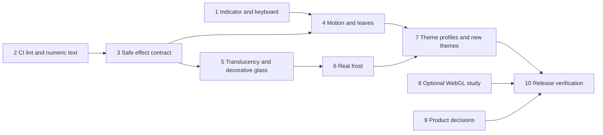

# Post-MVP Visual Effects and Polish Implementation Plan

> Historical snapshot: this document preserves the decisions, findings, and test
> results recorded on its date. Counts, source references, open items, and performance
> observations describe that snapshot. See the [v0.1 audit](../reviews/2026-10-08-v01-audit.md)
> for current dispositions and release verification.

> **For agentic workers:** REQUIRED SUB-SKILL: Use superpowers-subagent-driven-development or superpowers-executing-plans to implement this plan task-by-task. Steps use checkbox syntax for tracking.

**Goal:** Finish the post-MVP polish backlog and deliver all four approved visual effects with theme-specific fidelity and measured resource use.

**Architecture:** Pure core policies validate theme data and compute views. Native Shell actors implement motion and materials behind the existing controls. Optional WebGL investigation stays outside the required runtime.

**Tech Stack:** GNOME Shell 50, GJS ES modules, St/Clutter, GTK 4/libadwaita preferences, existing GJS harness; ESLint is developer tooling only.

**Spec:** [Post-MVP design](2026-10-07-post-mvp-design.md). Read it before execution; its theme matrix and budgets are acceptance criteria.

## Execution status (2026-10-07)

Tasks 1–3 and 7–9 have implementation/evidence; Tasks 4–6 have native rendering,
semantic pixel and lifecycle evidence. Headless and nested/devkit native gates passed after explicit sibling allocation and finite popup-anchor fixes. Automated release checks passed; reviewed work is retained on local branch `feat/post-mvp-effects`. Publication and merge await owner instructions.
Unchecked hardware/physical-session steps below are intentional: GPU frame duration,
fractional scaling, multiple monitors and human accessibility acceptance remain
unverified. Native callback/cadence measurements do not satisfy the GPU gate.
See the [validation record](../reviews/2026-10-07-post-mvp-validation.md).

Automated graphics checks use the private headless GNOME Shell helper and
`tools/effects-check.sh`; physical review remains available through
`tools/nested-shell.sh`. This adaptation provides repeatable synthetic backdrop,
image and resource checks while preserving the manual nested-shell gate.
Visual inventory coverage is 44 light/dark captures, supplemented by 264 native
policy/resource combinations for mode and animation settings. It is not a full
264-image screenshot matrix; this coverage adaptation is recorded explicitly.

## Global Constraints

- GNOME Shell 50 remains the target. GJS ES modules; no required native helper, browser engine or product build pipeline is introduced.
- `lib/core` remains pure JavaScript with no GI or Shell imports. St stays in `lib/ui`, `extension.js` and the theme manager; GTK/Adwaita stay in preferences.
- English code/docs/msgids; pt-BR in the translation catalog. Maintain both light and dark schemes. The panel keeps the dark scheme and has no ambient loop.
- A user theme overriding a built-in ID does not inherit built-in trust.
- Credentials, account identifiers, network bodies and clipboard contents never enter a decorative renderer, preview or performance report.

## Review Focus

- User overrides a built-in slug: executable effects remain unavailable to that untrusted file (Task 3).
- Rapid close, disable or theme change during an animation: no stale actor or callback paints after teardown (Tasks 4–6).
- A bright, detailed wallpaper sits under glass: quota values and focus remain readable (Tasks 5–7).
- Reduced motion changes while the popup is open: ambient movement stops immediately without changing account state (Task 4).
- Provider responses arrive during expansion or scrolling: the latest values render without replacing controls or stealing focus (Task 1).

## Execution order and file ownership

M5: Tasks 1–2, independent polish branch. M6: Tasks 3–7, native effects and theme
branch. M7: Tasks 8–9, separately reviewable optional capability/decision work.
Task 10 closes each delivered milestone. M4 remains closed.



Proposed new files are named below; they do not exist until their owning task.
Do not regenerate or change the 20 theme JSON files from a second concurrent task.
When using agents, assign exclusive file ownership, tell workers that others are
present, and review shared interfaces before parallel implementation.

### Task 1: Indicator modelling, coalescing and keyboard behavior

**Files:** Create `lib/core/barView.js`, `tests/barView.test.js`; modify
`lib/ui/indicator.js`, `lib/ui/barItem.js`, `lib/ui/popupExtras.js`,
`tests/run.js`, `tools/layout-probe.js`, `tools/layout-verify.js`.

**Interfaces:** `barView({snapshots, settings, now}) -> {items}` returns the same
plain item descriptions the current indicator paints. No scheduling or fitting
actors enter the core. Indicator owns one pending render source, retaining the
latest snapshots; the existing fitting debounce remains separate.

- [x] Capture current demo bar item outputs as fixtures; add tests for empty,
  paused, stale/error and multiple-provider responses. Prove that unchanged
  item descriptions remain equal and newest snapshots win a response burst.
- [x] Run `gjs -m tests/run.js`; confirm the new assertions fail before extraction.
- [x] Extract the current model unchanged; coalesce one event-loop burst into one
  redraw and remove the queued source on cleanup. Keep countdown rendering and
  refresh feedback. Make actual bar items keyboard-focusable and reuse tooltip
  focus handling. Capture Escape only when the legend is visible: first Escape
  hides it, second uses the existing popup close behavior.
- [x] Run `tools/check.sh` and `tools/layout-check.sh`; verify burst counts,
  retained focus, latest values, tooltip cleanup and the two-Escape sequence in
  `tools/nested-shell.sh`. Commit the independently verified polish change.

### Task 2: CI lint and tabular-number evidence

**Files:** Create `eslint.config.js`, `package.json`, `package-lock.json`,
`.github/workflows/lint.yml`; modify `tools/check.sh`, `lib/ui/meter.js`,
`lib/ui/providerCard.js`, `lib/core/theme.template.css`, `docs/development.md`
only where the numeric-font probe justifies a change.

- [x] Resolve and pin ESLint's supported Node version at execution time. Install
  development-only dependencies with a lockfile; define globals by actual file
  context, not a blanket browser environment. Pin CI actions to full commits.
- [x] Demonstrate `no-undef` rejection with a synthetic misspelled variable in a
  temporary fixture, then remove it. CI runs `npm ci` and `npm run lint` without
  a running desktop. Record success and workflow security checks.
- [x] Probe installed proportional and monospace fonts using Shell/Pango:
  measure widths of `1111`, `8888`, `09:59` and `10:00`. Verify an actually
  supported tabular-number mechanism, or apply a numeric-only font fallback.
  Do not assume browser `font-variant-numeric` works in St.
- [x] Run `tools/check.sh`, `npm run lint`, `tools/sast.sh` and nested-shell layout
  tests. Record font availability and numeric width evidence; commit.

### Task 3: Safe effect contract and controls

**Files:** Create `lib/core/themeEffects.js`, `tests/themeEffects.test.js`;
modify `lib/core/theme.js`, `lib/services/themeFiles.js`,
`lib/services/themeManager.js`, `lib/core/defaults.js`, `prefs.js`,
`schemas/org.gnome.shell.extensions.gnome-ai-quota.gschema.xml`,
`tests/theme.test.js`, `tests/run.js`, `docs/adr/0006-theming.md`, `docs/themes.md`.

**Interfaces:** `effectPolicy({origin, profile, mode, animationsEnabled,
transparencyEnabled, popupOpen}) -> {motion, material, particleCount}`.
`origin` is loader-owned `builtin|user`; `profile` is validated, allowlisted data;
`mode` is `off|subtle|full`; `motion` is `none|interaction|ambient`;
`material` is `opaque|translucent|decorative-glass|frosted-glass`.
Closed popup or mode off produces no motion; disabled system animations prohibit
ambient and animated interaction motion. User origin produces no executable effect.

- [x] Register failing policy tests, including this regression:

```js
test('theme effects: a user override never acquires builtin effects', () => {
    const result = effectPolicy({origin: 'user', profile: {
        material: 'frosted-glass', motion: 'leaves', particleCount: 999,
    }, mode: 'full', animationsEnabled: true,
    transparencyEnabled: true, popupOpen: true});
    assertEqual(result, {motion: 'none', material: 'opaque', particleCount: 0});
});
```

- [x] Run `gjs -m tests/run.js -- 'theme effects'` and observe failure. Implement
  bounded presets, separate opacity fields, origin propagation, compatibility
  with old files and safe invalid-profile fallback. Reject arbitrary shaders,
  URLs, paths, non-finite numbers and unbounded arrays.
- [x] Add Effects/Transparency preferences, live notifications and default
  classification. Preserve first-use state and accounts. Run `tools/build.sh`,
  `tools/check.sh`, `tools/prefs-smoke.sh`; commit contract and settings together.

### Task 4: Lifecycle-safe native motion and falling leaves

**Files:** Create `lib/ui/themeEffects.js`, `lib/ui/effects/leaves.js`,
`icons/theme-effects/leaves.svg`, `tools/effects-probe.js`;
modify `lib/ui/indicator.js`, `lib/services/themeManager.js`,
`tools/layout-probe.js`, `tools/layout-verify.js`.

**Interfaces:** `ThemeEffects({backgroundActor, decorationActor})` exposes
`apply({policy, theme, scheme})`, `setOpen(boolean)`, `destroy()`.
It owns all decoration actors, transitions and sources; it has no provider or
authentication dependency. Leaves use a packaged cached atlas, eight instances
initially, time-based movement and a twelve-instance cap.

- [x] Extend the nested-shell probe to fail on decoration outside popup bounds,
  reactive particles, stale callbacks and nonzero decoration-source counts after
  close/disable. Check reduced motion toggled live.
- [x] Implement clipped background/decoration layers without replacing provider
  controls. Reuse leaf textures and actors; stop updates on close. Allow short
  native interaction transitions independently of ambient effects.
- [x] Run static versus leaves measurements for 60 seconds each and 100 lifecycle
  cycles; record frame-time evidence and retained resource counts. Run
  `tools/check.sh`, `tools/layout-check.sh` and `tools/nested-shell.sh`; commit.

### Task 5: Translucency and decorative glass

**Files:** Create `lib/ui/effects/glass.js`; modify
`lib/ui/themeEffects.js`, `lib/core/theme.template.css`,
`tests/themeEffects.test.js`, `tools/effects-probe.js`.

- [x] Add failures for whole-popup opacity, translucent text, unbounded opacity,
  wallpaper bleed behind reading zones and decorative layers capturing events.
- [x] Implement background-only alpha and opaque reading surfaces. Implement
  decorative glass with cached internal gradients/specular borders; no desktop
  capture, browser process or ambient timer is needed for static glass.
- [x] Capture both materials on dark/light/detailed wallpapers with all controls
  and values identical. Test contrast, focus, RTL, enlarged text and transparency
  off. Run `tools/check.sh` and nested-shell probes; commit.

### Task 6: Real frosted glass on GNOME Shell 50

**Files:** Create `lib/ui/effects/frost.js`,
`docs/temp/reviews/2026-10-07-frost-feasibility.md`; modify
`lib/ui/themeEffects.js`, `tools/effects-probe.js`, `docs/pitfalls.md`.

- [x] Prototype inside `tools/nested-shell.sh` using installed Shell 50 APIs.
  Establish whether a native backdrop actor can be clipped and sample only the
  background under the popup. Record exact callable APIs and compatibility.
- [x] Establish failing visual checks: letters remain sharp; the desktop outside
  popup bounds remains sharp; moving a window behind the popup updates its frosted
  representation; no recursive popup capture; correct fractional scaling and
  multi-monitor origin. A frozen wallpaper-only imitation does not pass.
- [x] Implement one backdrop surface behind controls, fixed blur radius, safe
  teardown and decorative-glass runtime fallback on unsupported capability.
  Avoid per-card blur, changing blur radius during animation and broad capture.
- [x] Measure 60-second static versus frost frame times, open latency and resource
  teardown. Apply the spec's budgets. If the implementation fails a gate, record
  the unresolved requirement and proposed architecture change; do not declare
  frost delivered or add a mandatory helper silently. Commit only tested results.

### Task 7: Apply reviewed profiles and add new themes

**Files:** Modify `tools/gen-themes.py`, `themes/v1.txt`,
`themes/builtin/sistema-gnome/theme.json`, generated
`themes/builtin/<id>/theme.json` for each matrix entry,
`lib/prefs/themeCatalog.js`, `tests/theme.test.js`, `po/pt_BR.po`,
`po/gnome-ai-quota.pot`, `docs/themes.md`; create
`themes/builtin/organic-biophilic/theme.json`,
`themes/builtin/glassmorphism/theme.json`,
`docs/temp/reviews/2026-10-07-theme-fidelity.md`.

- [x] Read each corresponding design domain skill and pinned gallery CSS/effect
  before implementing its profile. Record original visual intent, chosen effects,
  adaptations and exclusions for every matrix row. Implement shared primitives
  in `lib/ui/effects/` only when required by these profiles; no arbitrary theme code.
- [x] Test every built-in profile's allowlist and static fallback; replace the
  fixed inventory count assertion with the explicitly expected slug set including
  the two new themes. Test both schemes and unknown-profile rejection.
- [x] Add profiles in generator source, regenerate with its documented invocation
  in `docs/development.md`, and verify deterministic output. Keep manually authored
  System changes separate. Do not hand-edit generated theme JSON.
- [x] Give Glassmorphism its three compatible material choices; keep incompatible
  overrides out of editorial/flat styles. All themes support the motion policy;
  no-effect choices in the matrix are deliberate design decisions.
- [x] Run `tools/check.sh`, `tools/prefs-smoke.sh`, `tools/layout-check.sh` and
  full inventory captures in the nested Shell for light/dark, off/subtle/full,
  reduced motion and opaque fallback. Review pt-BR with a second reader; identify
  whether that reader is human or an agent. Commit with the fidelity report.

### Task 8: Optional WebGL and preview study

**Files:** Create `docs/temp/reviews/2026-10-07-webgl-feasibility.md`;
experiments stay outside the packaged runtime until an architectural decision.

- [x] Compare existing native/static previews with an optional GTK/WebKit preview
  using packaged synthetic content. Measure startup, memory, frame time and
  disposal on the verified local WebKit version. Disable network/navigation and
  reject renderer-provided links or code from theme JSON.
- [x] Prove behavior when WebKit is absent or WebGL fails. Record whether native
  previews suffice for the accepted four options. Do not add WebKit as a required
  dependency or claim native shaders are WebGL.
- [x] For a future genuinely WebGL-dependent gallery style, report real
  isolated-renderer-to-St transfer feasibility, costs and ABI/dependency impact.
  Submit a separate ADR proposal before introducing that bridge. Commit the
  evidence and keep unsupported WebGL-in-popup explicitly outside this release.

### Task 9: Resolve the remaining product questions

**Files:** Create `docs/temp/plans/2026-10-07-post-mvp-product-decisions.md`;
modify ADRs 0006/0008/0010 only when the corresponding choice is resolved.

- [x] Propose a separate explicit disconnect-all action with Cancel as default.
  Define deletion scope: app-owned keyring entries, snapshot and alert caches;
  custom themes, fonts, public client configuration and terms acknowledgements
  remain unless individually selected. Specify coordination with in-flight
  login writes and refreshes so deletion cannot be undone by late completion.
  Restore defaults must continue to preserve accounts.
- [x] Propose optional font installation separately: explicit consent, licensed
  allowlisted downloads, bounded size, no overwrite of user fonts, cancellable
  async I/O and offline fallback. Do not infer font-install consent from a theme.
- [x] Propose independent warning/critical thresholds with ordering, hysteresis,
  dedupe, cache migration and no notification storm. Preserve today's single
  threshold until the product decision is accepted.
- [x] List actual whole-keyboard, Orca and live-provider checks still requiring
  human/account participation. No test tool may inspect real credential values.
  Commit the concrete proposals; undecided product changes remain open decisions.

### Task 10: Release review and documentation

**Files:** Modify ADRs 0006/0008/0010, `docs/themes.md`, `docs/development.md`;
create `docs/temp/reviews/2026-10-07-post-mvp-validation.md`.

- [x] Run `tools/check.sh`, `npm run lint`, `tools/prefs-smoke.sh`,
  `tools/layout-check.sh`, `tools/sast.sh`, `tools/pack.sh`. Verify the packaged
  files match source, including assets; report unavailable checks accurately.
- [x] Review architecture, UI/UX, frontend and security against the spec, with
  independent reviewers when executing through agents. Fix findings and annotate
  accepted divergences. Include performance baselines, hardware/session metadata,
  screenshot comparisons, fallback paths and manual-test limitations.
- [x] Update implemented status only for delivered capabilities. Keep real frost
  open if its gate failed; keep optional studies and product decisions distinct.
  Prepare commits/PRs by milestone and await publication/merge instructions when
  not already authorized. Synchronize after confirmed merges.

## Final follow-up evidence

The October 8 regression closure passes 415 unit tests, private preferences and
credential integrations, twelve primary-reading layouts, 264 resource combinations,
44 theme captures, 100 lifecycle cycles, pointer close tests, fractional monitor
pixel controls, paired lateral shadows and strict native-error rejection. The
fresh four-condition 60-second processing profile passes with recorded source
hashes; leaves remain close to the added-cost limit. See
[final release validation](../reviews/2026-10-08-release-validation.md).
Physical GPU/monitor, lock/suspend, human Orca and real-account certification remain
explicit participation limits, separate from the completed synthetic gates.
